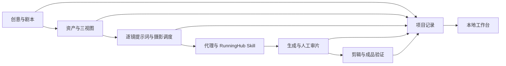

# Thirdspace AIGC Workbench

**把剧本、三视图、分镜提示词和审片结果放进同一个工作台。**

这是一个面向 AI 视频创作者的本地制作工作台，配套可单独安装的 RunningHub 故事视频 Skill。适合已经用代理协作创作，希望把多作品、多镜头和返工记录组织清楚的人。


> 上图来自实际运行的工作台。仓库示例是原创三镜故事与 SVG 参考示意，尚未上传 RunningHub，也没有生成视频。

## 两个部分，一份制作记录

| 部分 | 可以做什么 |
|---|---|
| 工作台 | 查看作品总览、制作进度、剧本资料、人物/场景/道具、分镜引用、提示词和文件台账 |
| 执行器 | 运行准备队列、检查依赖、保存状态与恢复记录；可选接入 Ego 和 Codex CLI |
| RunningHub Skill | 指导代理准备参考图与摄影调度，操作画布，核验费用，记录生成与审片结果 |
| 项目记录 | 版本化 YAML 保存资产、镜头与审片数据；Markdown 是生成的阅读页 |

工作台是**只读快照**，配套的 `queue/automation.py` 是实际可运行的命令行执行器。准备任务无需代理；浏览器观察需要 Ego Lite，实验性生成适配器还需要 Codex CLI 和你自己的 RunningHub 登录。

**当前验证范围：准备队列、真实浏览器观察、CLI 调用链路已验证；自动生成视频尚待端到端验收，不作为稳定能力承诺。**



## 快速开始

需要 Python 3.10+。查看工作台无需 Node.js；前端产物已包含。macOS/Linux：

```bash
git clone https://github.com/zzyong24/thirdspace-aigc-workbench.git
cd thirdspace-aigc-workbench
python3 -m venv .venv
source .venv/bin/activate
python3 -m pip install --index-url https://pypi.org/simple -r requirements.txt
python3 queue/serve_board.py
```

Windows 用 `py -3 -m venv .venv`，PowerShell 激活命令为 `.venv\Scripts\Activate.ps1`；激活后使用相同的 pip 和 Python 命令。工作台、记录工具和本地准备执行器有 Windows CI；Ego 浏览器流程目前只在 macOS 验证。

安装命令使用官方 PyPI 源，避免继承本机失效的镜像配置。

打开 [本地工作台](http://127.0.0.1:8767/queue/board.html)。启动时会刷新记录，默认仅监听本机；端口占用可用 `--port 8768`，Ctrl+C 停止。安装后可离线浏览本地项目；RunningHub 生成仍需联网。

演示顺序：**作品总览 → 示例项目 → 剧本与资料 → 素材资产 → 分镜用料 → 提示词 → 文件台账**。资料目录也能阅读 Skill 与操作经验。

## 新建自己的作品

```bash
python3 projects/new_project.py my-story --title "我的故事"
```

脚手架建立方案、研究、剧本、资产与镜头 YAML、音源记录、审片模板和运行日志；不会提交生成任务。参考 `projects/demo-rooftop/` 填写自己的记录，再执行：

```bash
python3 projects/render_records.py projects/my-story
python3 queue/build_board.py
```

刷新浏览器即可查看。新项目自动进入总览；要排执行任务，再登记到 `queue/anytime.yaml` 或 `queue/points-21.yaml`。详细规则见 [项目规范](projects/AGENTS.md)、[文件命名](projects/FILE_RULES.md) 和 [记录格式](docs/records.md)。

## 可执行的自动化

先跑仓库自带的零新增费用示例：

```bash
python3 queue/automation.py doctor
python3 queue/automation.py run
python3 queue/automation.py run --execute
python3 queue/automation.py status
```

第二条只打印计划；第三条实际校验并渲染教学项目，再刷新工作台数据。重复执行不会重跑同一输入。项目 YAML 变动后，本地准备任务会重新执行；浏览器任务输入变化或运行中断后，须检查原任务并明确恢复。

持续处理就绪的准备任务：

```bash
python3 queue/automation.py watch --execute --interval 30
```

它是前台进程，Ctrl+C 停止，电脑休眠时不会唤醒；不注册系统定时任务。积分任务不会被这条命令批量执行。真实队列契约、Ego/Codex 安装、浏览器检查、费用窗口、模型选择、恢复步骤与实验性生成入口见 [自动化使用手册](docs/automation.md)。

## 单独安装 RunningHub Skill

```bash
python3 scripts/install_skill.py
```

默认复制到当前用户的 `~/.codex/skills/runninghub-minimax-story-video/`，已有安装时会停止，避免覆盖。其他 Skill 宿主可指定其发现目录：

```bash
python3 scripts/install_skill.py --skills-dir /path/to/your/skills
```

重载代理后，用自然语言调用：

> 使用 runninghub-minimax-story-video，把这个故事做成15秒三镜视频。先准备人物、场景和道具三视图，写清每镜起始机位、带时间段的运动、停点和下一镜承接；生成前向我报告当前费用。

独立使用不依赖工作台目录，按 [Skill 的记录契约](.agents/skills/runninghub-minimax-story-video/references/records.md) 维护自己的项目。安装 Skill 不会安装 Ego Lite、登录 RunningHub 或授权付款。Ego Lite 目前提供 Mac 版本；从 [官方网站](https://lite.ego.app/) 安装并完成 onboarding，它会把 ego-browser Skill 安装到代理的技能目录。然后在本仓库运行 `python3 queue/automation.py doctor --browser` 检查依赖。

## 配置与使用边界

[queue/index.yaml](queue/index.yaml) 配置模型、时区、积分窗口和预算；新安装默认**不授权积分、未配置自动化、预算为 0**。使用者需在当前上下文明确授权，再逐节点核验报价与余额；配置 true 不代替用户授权。不使用现金钱包，不购买或充值积分。

免费窗口、模型名称、并发数、时长和分辨率可能变化，以现场 UI 为准。登录、验证码或浏览器交接需要用户处理。一个作品保持一个浏览器工作区和一张画布，超时先查原任务，避免重复提交。在线成品只有输出节点实际可播放才标记完成。

实际作品和日志保存在你自己的工作区；公开分享前检查画布链接、肖像、音乐授权和登录信息。仓库只提供原创教学示例，没有原制作账户或私人作品历史。

## 开发与验证

修改界面时需要 Node.js 20+：

```bash
npm ci --prefix queue/board-ui
npm run build --prefix queue/board-ui
python3 queue/build_board.py
python3 -m unittest discover -s tests -v
```

验证包括 38 项 Python 测试、真实 Ego 浏览器的 39 项界面检查（1440/768/390px）、前端构建、Ant Design lint、RunningHub 实际页面观察及 Codex CLI 结构化输出。CI 运行 Python 3.10/3.13 × Windows/macOS/Linux，以及 Node 20/22 构建；结果与验证边界见 [验证记录](docs/validation.md)。

可选真实界面回归（先启动工作台、打开并完成 Ego onboarding）：

```bash
python3 scripts/check_ui.py
```

此命令创建一个独立测试浏览器空间，完成后关闭它；已有代理目标空间用 `--space <数字ID> --page p2` 显式复用。

下一步：完成指定作品的自动生成与中断恢复实机验收，再将生成适配器从实验状态升级；补充镜头音频/对白审片字段。

## 许可证与致谢

自有代码、Skill、文档和原创示例采用 [MIT License](LICENSE)。前端依赖保留各自许可证，见 [第三方声明](THIRD_PARTY_NOTICES.md)。RunningHub、MiniMax 与 Ego Lite 是外部服务/工具，本项目不代表它们的官方产品。

可选镜头语言参考：[LearnPrompt/awesome-seedance](https://github.com/LearnPrompt/awesome-seedance)，未将其上游仓库或示例素材打包分发。
