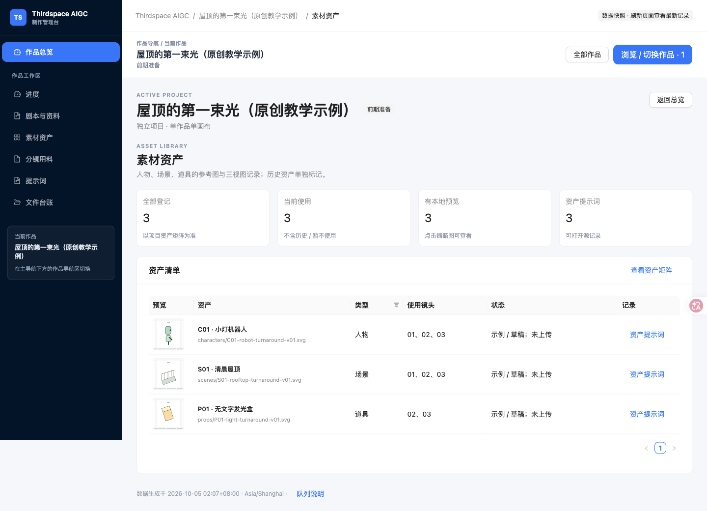
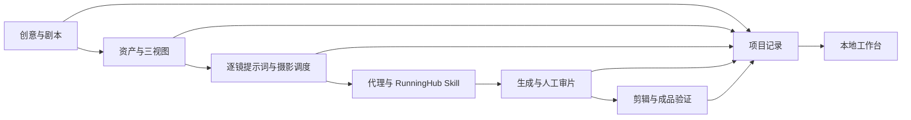

# Thirdspace AIGC Workbench

**把剧本、三视图、分镜提示词和审片结果放进同一个工作台。**

这是一个面向 AI 视频创作者的本地制作工作台，配套可单独安装的 RunningHub 故事视频 Skill。适合已经用代理协作创作，希望把多作品、多镜头和返工记录组织清楚的人。



> 上图来自实际运行的工作台。仓库示例是原创三镜故事与 SVG 参考示意，尚未上传 RunningHub，也没有生成视频。

## 两个部分，一份制作记录

| 部分 | 可以做什么 |
|---|---|
| 工作台 | 查看作品总览、制作进度、剧本资料、人物/场景/道具、分镜引用、提示词和文件台账 |
| RunningHub Skill | 指导代理准备参考图与摄影调度，操作画布，核验费用，记录生成与审片结果 |
| 项目记录 | 版本化 YAML 保存资产、镜头与审片数据；Markdown 是生成的阅读页 |

工作台是**只读快照**，不自带视频生成器、浏览器执行器或定时任务。Skill 需要支持 Skill 的代理环境、单独安装的 Ego Lite / ego-browser，以及你自己的 RunningHub 登录。浏览工作台不需要这些依赖。



## 快速开始

需要 Python 3.10+。查看工作台无需 Node.js；前端产物已包含。macOS/Linux：

```bash
git clone https://github.com/zzyong24/thirdspace-aigc-workbench.git
cd thirdspace-aigc-workbench
python3 -m venv .venv
source .venv/bin/activate
python3 -m pip install --index-url https://pypi.org/simple -r requirements.txt
python3 queue/serve_board.py
```

Windows 用 `py -3 -m venv .venv`，PowerShell 激活命令为 `.venv\Scripts\Activate.ps1`；激活后使用相同的 pip 和 Python 命令。Windows 步骤尚未实机验证。

安装命令使用官方 PyPI 源，避免继承本机失效的镜像配置。

打开 [本地工作台](http://127.0.0.1:8767/queue/board.html)。启动时会刷新记录，默认仅监听本机；端口占用可用 `--port 8768`，Ctrl+C 停止。安装后可离线浏览本地项目；RunningHub 生成仍需联网。

演示顺序：**作品总览 → 示例项目 → 剧本与资料 → 素材资产 → 分镜用料 → 提示词 → 文件台账**。资料目录也能阅读 Skill 与操作经验。

## 新建自己的作品

```bash
python3 projects/new_project.py my-story --title "我的故事"
```

脚手架建立方案、研究、剧本、资产与镜头 YAML、音源记录、审片模板和运行日志；不会提交生成任务。参考 `projects/demo-rooftop/` 填写自己的记录，再执行：

```bash
python3 projects/render_records.py projects/my-story
python3 queue/build_board.py
```

刷新浏览器即可查看。新项目自动进入总览；要排执行任务，再登记到 `queue/anytime.yaml` 或 `queue/points-21.yaml`。详细规则见 [项目规范](projects/AGENTS.md)、[文件命名](projects/FILE_RULES.md) 和 [记录格式](docs/records.md)。

## 单独安装 RunningHub Skill

```bash
python3 scripts/install_skill.py
```

默认复制到当前用户的 `~/.codex/skills/runninghub-minimax-story-video/`，已有安装时会停止，避免覆盖。其他 Skill 宿主可指定其发现目录：

```bash
python3 scripts/install_skill.py --skills-dir /path/to/your/skills
```

重载代理后，用自然语言调用：

> 使用 runninghub-minimax-story-video，把这个故事做成15秒三镜视频。先准备人物、场景和道具三视图，写清每镜起始机位、带时间段的运动、停点和下一镜承接；生成前向我报告当前费用。

独立使用不依赖工作台目录，按 [Skill 的记录契约](.agents/skills/runninghub-minimax-story-video/references/records.md) 维护自己的项目。安装 Skill 不会安装 Ego Lite、登录 RunningHub 或授权付款。

## 配置与使用边界

[queue/index.yaml](queue/index.yaml) 配置模型、时区、积分窗口和预算；新安装默认**不授权积分、未配置自动化、预算为 0**。使用者需在当前上下文明确授权，再逐节点核验报价与余额；配置 true 不代替用户授权。不使用现金钱包，不购买或充值积分。

免费窗口、模型名称、并发数、时长和分辨率可能变化，以现场 UI 为准。登录、验证码或浏览器交接需要用户处理。一个作品保持一个浏览器工作区和一张画布，超时先查原任务，避免重复提交。在线成品只有输出节点实际可播放才标记完成。

实际作品和日志保存在你自己的工作区；公开分享前检查画布链接、肖像、音乐授权和登录信息。仓库只提供原创教学示例，没有原制作账户或私人作品历史。

## 开发与验证

修改界面时需要 Node.js 20+：

```bash
npm ci --prefix queue/board-ui
npm run build --prefix queue/board-ui
python3 queue/build_board.py
python3 -m unittest discover -s tests -v
```

已做作者自测：Python 记录校验与脚手架回归、陌生路径安装、前端构建、Ant Design lint、Ego Lite 实际界面与静态资源预览。发布检查见 [docs/validation.md](docs/validation.md)。示例未提交真实视频任务；没有声称当前 RunningHub 全流程已经复测。Windows、Linux 浏览器流程与其他代理宿主未实机验证。

后续方向：带状态验证的记录迁移、镜头音频/对白审片字段，以及在明确宿主契约下接入可选调度器。

## 许可证与致谢

自有代码、Skill、文档和原创示例采用 [MIT License](LICENSE)。前端依赖保留各自许可证，见 [第三方声明](THIRD_PARTY_NOTICES.md)。RunningHub、MiniMax 与 Ego Lite 是外部服务/工具，本项目不代表它们的官方产品。

可选镜头语言参考：[LearnPrompt/awesome-seedance](https://github.com/LearnPrompt/awesome-seedance)，未将其上游仓库或示例素材打包分发。
